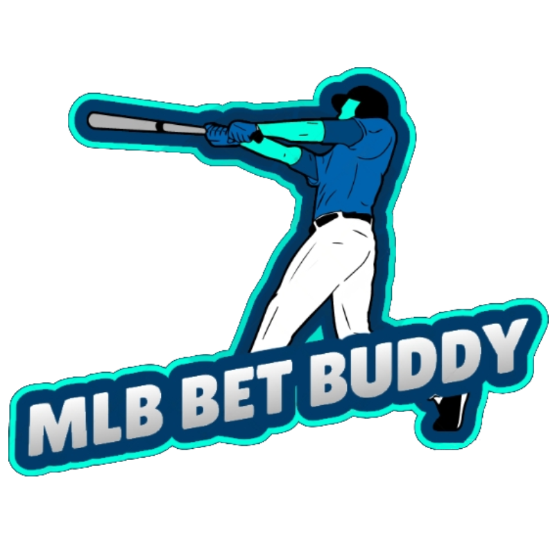

# MLB Bet Buddy

The MLB Bet Buddy is a helpful tool, which creates daily bet predictions on outcomes of MLB games. This is the server portion of the application, and its main responsibility is to automatically extract real-time data from the MLB API and generate the daily bet predictions. Daily bet predictions are stored in a database for quick access (see the Android app portion of the application to see how the bet predictions are displayed) and accuracy checking purposes.

## Bet Prediction Creation
The formulas created for bet prediction creation are complex, and involve numerous offensive and pitching statistics. Formulas were rigourously backtested with hundreds of games and player statistics from previous seasons. Additionally, local factors about each game are included into the calculations, and these include factors such as the weather, wind speeds, run generation factors of each stadium, and more. Machine learning algorithms, such as Bayesian Optimization, were used to optimize the impact of each individual statistic in the formula in order to make the bet predictions as accurate as possible.

**Note:** All formulas and processes regarding the bet prediction creation have been omitted from this repository. If you wish to learn more about how the bet predicitons are created, reach out to me.

## NRFI & YRFI Bet Predicitions
The first main type of bet predictions that the MLB Bet Buddy makes is NRFI and YRFI bets, which stand for "No Run First Inning" and "Yes Run First Inning" respectively. All this means is that you are betting on whether or not a run will be scored in the first inning of the game by either team. If after the 1st inning concludes and no run has been scores, the NRFI wins, and if after the 1st inning concludes at least 1 run has been scored by either team, the YRFI wins. These types of bets have quickly become some of the most popular bet types among baseball bettors, as they finish much quicker than an entire baseball game.

## Hitting Bet Predictions
There are several popular hitting bet predictions and it is difficult to optimize for one specific type, so the MLB Bet Buddy predicts which qualified MLB hitters have the most optimal matchups against the starting pitchers they are facing on a given day. This is because a batter will face the starting pitcher the most times in a game the majority of the time. By making predictions this way, the hitting bet preditions can apply to a wide variety of hitting bets. This includes bet types such as: Over 0.5 hits, Over 1.5 hits, Over 1.5 Hits + Runs + RBIs, Over 2.5 Hits + Runs + RBIs, and many more.

## Demonstration
For a full demonstration of the MLB Bet Buddy in action, please refer to this video: 
https://www.youtube.com/watch?v=bS1m9EqOyjk
